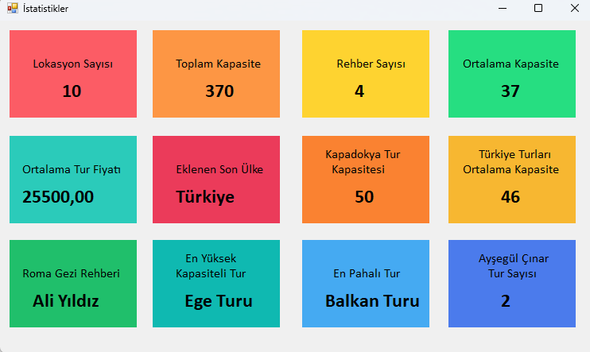

# C# Eğitim Kampı Projesi: Seyahat ve Turizm İstatistikleri

**Teknolojiyi keşfetmeye ve yazılım becerilerinizi bir üst seviyeye taşımaya hazır mısınız?**  
Murat Yücedağ'ın YouTube kanalında sunduğu **C# Eğitim Kampı** ile siz de profesyonel bir yazılım geliştirme deneyimi yaşayabilirsiniz!

Bu özel proje, **Entity Framework** ve **LINQ** sorgularını kullanarak dinamik ve kullanıcı dostu bir **istatistik formu** sunuyor.  
Seyahat ve turizm sektörüne dair verileri analiz ederek, kullanıcıların ihtiyaç duyduğu istatistiklere hızlı ve doğru şekilde erişmelerini sağlıyor.

## Projenin Öne Çıkan Özellikleri

- **Veri Analizi Gücü:**  
  LINQ sorguları ile kapsamlı veri analizleri yaparak, karmaşık istatistikleri kolayca anlaşılır hale getirir.

- **Modern Teknoloji Kullanımı:**  
  Entity Framework sayesinde veritabanı işlemlerini hızlı ve etkili bir şekilde yönetir.

- **Eğitim Odaklı İçerik:**  
  Yazılım geliştirme sürecini adım adım öğrenmek isteyenler için ideal bir rehberdir.

Bu projeyi kaçırmayın ve yazılım dünyasında fark yaratın!  
Hemen [Murat Yücedağ'ın YouTube Eğitim Kampı'na](https://www.youtube.com/watch?v=oev5wH-_XCI&t=472s) göz atın ve C# Eğitim Kampı'na katılın! 💻✨

